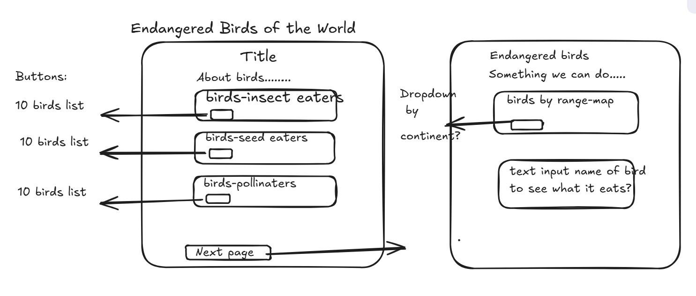

# Endangered Birds of the World

## The Problem
Nature lovers need to know which "endangered" birds live nearby so they can help.  One way to help is to provide the kind of food the birds' need to live on.  My page will show you the birds' and their usual diet.

## The Plan
 
 
## What Changed
With the 'Range Maps' proving inaccurate, I couldn't show the endangered birds by continent for the user.  Had to adjust 2nd page because of it.  Still could use Image and Diet, so made a 'button' for those.

## How the request reaches my API
A visitor clicks a button.  That initiates an async function that fetches the information from the array in my API (no "api-key needed), for example:"https://student-data-api.cindino45.workers.dev/api/v1/datasets/birds-of-the-world/records?search=insects&limit=20".  For each of the 4 buttons on my page, different search object properties are "called" and in different amounts.  They 'pass-through' a random function and then either an output-list is given or a picture with "diet' needs.
  
### Sections
* section 1: h1 - main headline title, main tagline, and cover picture with citation.
* section 2: h2 - "about Birds", and information about birds.
* section 3: h3 - birds that help with pest control, sentence explaining insect eating birds, and button that user "clicks" will show(output) a list of insect eating birds.
* section 4: h3 - birds that spread seeds, sentence explaining seed spreading birds, and button that user "clicks" will show(output) a list of fruit eating birds.
* section 5: h3 - birds that are pollinators, sentence explaining that birds help pollinate, and button that user "clicks" will show(output) a list of nectar consuming birds.

### User Input
 * button that user "clicks" will show(output) a list of insect eating birds.
 * button that user "clicks" will show(output) a list of fruit eating birds
 * button that user "clicks" will show(output) a list of nectar consuming birds.
### Outputs
 * a list of insect eating birds.
 * a list of fruit eating birds.
 * a list of nectar consuming birds.
## Data
Field: - Example Value: 

* id    -   4,
* Name   - Amsterdam Albatross,
* Scientific Name - Diomedea amsterdamensis,
* Conservation Status - Endangered,
* Primary Color - Black,
* Diet - "squid, fish, crustaceans",
* Image of Range - https://www.oiseaux.net/maps/svg/albatros.d.amsterdam.svg,
* Image of Bird - https://upload.wikimedia.org/wikipedia/commons/thumb/c/cc/Amsterdam_Albatross_0A2A3755.jpg/1920px-Amsterdam_Albatross_0A2A3755.jpg

    
## Who would use it

Someone interested in helping endangered birds.

For example:
- Which birds are endangered?
- Which endangered birds are near me?
- What do the birds need for their diet?

## Team
Accountability partners:
 
- mattwainwright-dev
- Anastasia-2012
- @Hexaxolotl

##Links
 * https://sndymrn13.github.io/capstone-level-2/
 * https://github.com/SnDyMrn13/capstone-level-2
